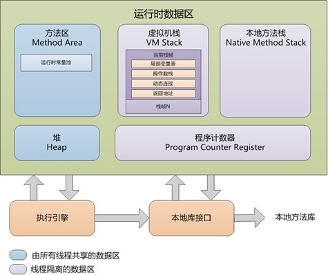
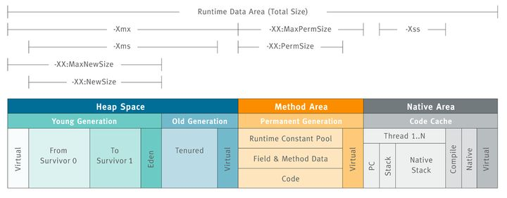

## JVM Memory Model

> 参考《深入理解Java虚拟机：JVM高级特性与最佳实践（第2版）》

### Java Heap

- jvm管理的内存中最大；被所有线程共享；存放对象实例，几乎所有的对象实例在此分配对象。

- 垃圾收集器管理的主要区域，亦称“GC堆”。

### Java Virtual Machine Stacks-Java虚拟机栈

- 线程私有，生命周期与线程相同；
- 每个线程中方法的调用又会在本栈中创建一个栈帧。
- 局部变量表存放了编译期可知的各种基本数据类型（boolean、byte、char、short、int、float、long、double 64位的long、double占两个局部变量空间（slot），其余占一个）、对象引用（reference类型，它不等同于对象本身，可能是一个指向对象起始地址的引用指针，也可能是指向一个代表对象的句柄或其他与此对象相关的位置）和returnAddress类型（指向了一条字节码指令的地址）。

### Method Area-方法区（非堆）

- 线程共享；存储已被虚拟机加载的类信息、常量、静态变量、即时编译后的代码等数据。

### Native Method Stack-本地方法栈

- 类似虚拟机栈发挥的作用类似，区别在于虚拟机栈为虚拟机执行Java方法（也就是字节码）服务，而本地方法栈则为虚拟机使用到的Native方法服务。

### Program Counter Register-程序计数器

- 线程私有；它可以看作是当前线程所执行的字节码的行号指示器。指向下一条要执行的指令。

### 内存结构布局与相应的控制参数

## JVM Memory Pools(Heap)

- used 
- commited
- Max

### PS Eden Space

### PS Old Gen

### PS Survivor Space

## JVM Memory Pools(Non-Heap)
- used 
- commited
- Max

### Metaspace

### Compressed Class Space

### Code Cache

## GC（Garbage Collection）

> 参考：[从实际案例聊聊Java应用的GC优化](https://tech.meituan.com/2017/12/29/jvm-optimize.html)

### Collections（回收频率）

### Pause Durations

> 是指垃圾处理器停止应用程序的运行，专注于空间释放时所花的时间.

### Allocated/Promoted(分配与晋升)