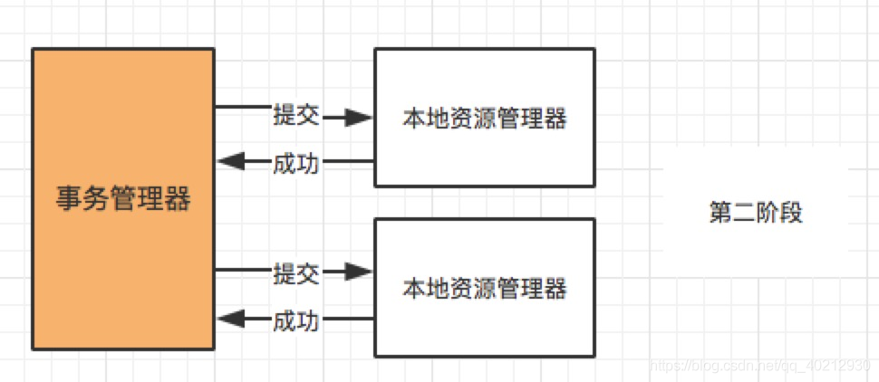
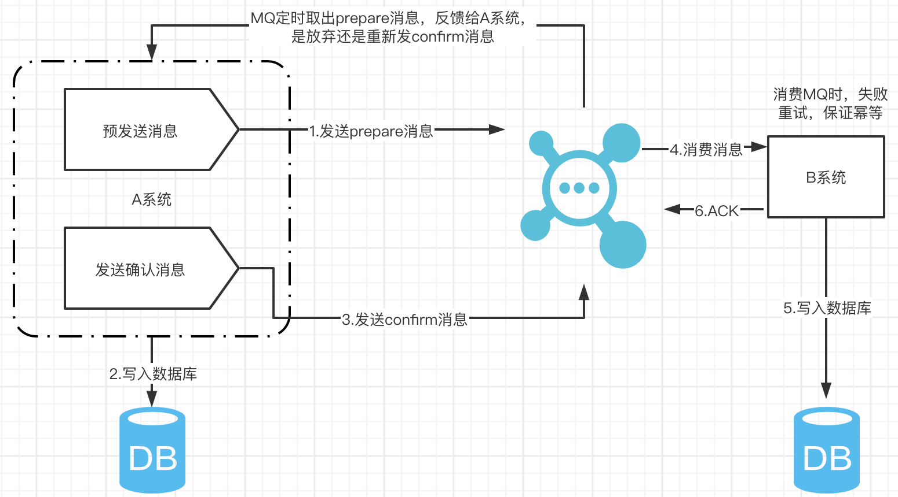

[..](./../classic-architecture/index.md)
# 分布式事务
## 基础理论

### 事务

> ACID 特性:原子性、一致性、隔离性、持久性

### 分布式事务

### 一致性

- 强一致性

- 弱一致性

- 最终一致性

### CAP 原则

#### 一致性（C）

> 在分布式系统中的所有数据备份，在同一时刻是否同样的值。（等同于所有节点访问同一份最新的数据副本）

#### 可用性（A）

> 在集群中一部分节点故障后，集群整体是否还能响应客户端的读写请求。（对数据更新具备高可用性）

#### 分区容错性（P）

> 以实际效果而言，分区相当于对通信的时限要求。系统如果不能在时限内达成数据一致性，就意味着发生了分区的情况，必须就当前操作在 C 和 A 之间做出选择。

### BASE 理论(柔性事务)

#### BA

> Basically Available 基本可用，分布式系统在出现故障的时候，允许损失部分可用性，即保证核心可用。

#### S

> Soft State 软状态，允许系统存在中间状态，而该中间状态不会影响系统整体可用性

#### E

> Consistency 最终一致性，系统中的所有数据副本经过一定时间后，最终能够达到一致的状态

### 幂等操作

> 不用担心重复执行会对系统造成改变

## 解决方案

### 分布式事务使用场景

- 转账
- 下单扣库存
- 同步超时

### 两阶段提交（XA）

> 大致的流程：
> 第一阶段（prepare）：事务管理器向所有本地资源管理器发起请求，询问是否是 ready 状态，所有参与者都将本事务能否成功的信息反馈发给协调者；
> 第二阶段 (commit/rollback)：事务管理器根据所有本地资源管理器的反馈，通知所有本地资源管理器，步调一致地在所有分支上提交或者回滚。

#### 存在的问题？

- 同步阻塞： 当参与事务者存在占用公共资源的情况。其中一个占用了资源，其他事务参与者就只能阻塞等待资源释放，处于阻塞状态。
- 单点故障：一旦事务管理器出现故障，整个系统不可用
- 数据不一致：在阶段二，如果事务管理器只发送了部分 commit 消息，此时网络发生异常，那么只有部分参与者接收到 commit消息，也就是说只有部分参与者提交了事务，使得系统数据不一致。
- 不确定性：当协事务管理器发送 commit 之后，并且此时只有一个参与者收到了
  commit，那么当该参与者与事务管理器同时宕机之后，重新选举的事务管理器无法确定该条消息是否提交成功。

### TCC（Try-Confirm-Cancel）

- Try 阶段：尝试执行，完成所有业务检查（一致性）, 预留必须业务资源（准隔离性）
- Confirm 阶段：确认执行真正执行业务，不作任何业务检查，只使用 Try 阶段预留的业务资源,Confirm 操作满足幂等性。要求具备幂等设计，Confirm 失败后需要进行重试。
- Cancel 阶段：取消执行，释放 Try 阶段预留的业务资源 Cancel 操作满足幂等性 Cancel 阶段的异常和 Confirm 阶段异常处理方案基本上一致。

#### TCC 事务机制相比XA优点

- 解决了协调者单点，由主业务方发起并完成这个业务活动。业务活动管理器也变成多点，引入集群。
- 同步阻塞：引入超时，超时后进行补偿，并且不会锁定整个资源，将资源转换为业务逻辑形式，粒度变小。
- 数据一致性，有了补偿机制之后，由业务活动管理器控制一致性

#### 存在问题？代码实现复杂度相对较高

- 需要新增一个锁定的相关字段
- 一个业务接口变成三个接口

#### 异常总结？

### Saga

> 核心思想：将长事务拆分为多个本地短事务，由Saga事务协调器协调，如果正常结束那就正常完成，如果某个步骤失败，则根据相反顺序一次调用补偿操作。

**Saga的执行顺序有两种：**

- T1, T2, T3, ..., Tn：向前恢复，重试失败的事务，假设每个子事务最终都会成功。
- T1, T2, ..., Tj, Cj,..., C2, C1，其中0 < j < n：向后恢复，逆序补偿所有已完成的事务。

### 本地消息表

#### 操作步骤

- 当系统A被其他系统调用发生数据库表变更操作，首先会更新数据库的业务表，其次会往相同数据库的消息表中插入一条数据，两个操作发生在同一个事物中
- 系统A的脚本定期轮询本地消息往MQ中写入一条消息，如果消息发送失败会进行重试
- 系统B消费MQ中的消息，并处理业务逻辑。如果本地事务处理失败，会在继续消费MQ中的消息进行重试，如果业务上的失败，可以通知系统A进行回滚操作

#### 实现的条件

- 消费者与生产者的接口都支持幂等
- 生产者需要额外的创建消息表
- 需要提供补偿逻辑，如果消费者业务失败，需要生产者支持回滚操作

#### 容错机制

- 步骤一失败时，事务直接回滚
- 步骤二、三写MQ与消费MQ失败会进行重试
- 步骤三业务失败系统B向系统A发起事务回滚操作

### 可靠消息最终一致性

#### 操作步骤

- A系统先向MQ发送一条prepare消息，如果prepare消息发送失败，则直接取消操作
- 如果消息成功，则执行本地事务
- 如果本地事务执行成功，则向MQ发送一条confirm消息；如果失败，则发送回滚信息
- B系统定期消费MQ中的confirm消息，执行本地事务，并发送ack信息；如果B系统中的本地事务失败，会一直不断重试，如果是业务失败，会向A系统发起回滚请求
- MQ会定期轮询所有prepared消息调用系统A提供的接口查询消息的处理情况，如果该prepare消息本地事务处理成功，则重新发送confirm消息，否则直接回滚该消息

#### 与本地消息对比

- 去掉了本地消息表
- 本地消息表依赖消息表重试写入MQ这一步由本方案中的轮询prepare消息状态来重试或者回滚该消息替代
- 目前市面上实现该方案的只有阿里的RocketMQ

### 尽最大努力通知

> 适用于一些最终一致性时间敏感度低的业务

#### 流程

- 系统A本地事务执行完之后，发送个消息到MQ
- 这里会有个专门消费MQ的服务，这个服务会消费MQ并调用系统B的接口
- 要是系统B执行成功就okl；要是系统B执行失败了，那么最大努力通知服务就定时尝试重新调用系统B吗，反复N次，最后还是不行就放弃

## 实战

### 两阶段提交/XA

> seata

### TCC

> 实现太复杂