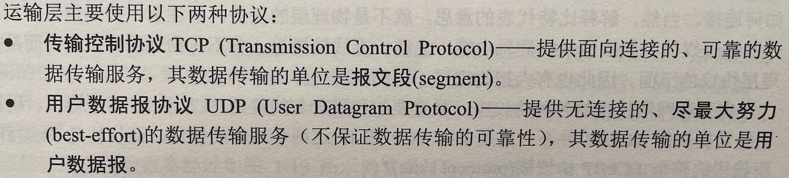

[..](./../basis-standard/index.md)

# TCP基础

## 分层

## 应用层

> 应用进程间通信和交互规则。包含域名系统DNS、万维网HTTP、电子邮件SMTP等；
>
> 应用层交互的数据单位为报文（message）。

## 运输层（TCP与UDP）

## 

## 网络层

> 负责为分组交换网络上不同主机提供通信服务。
>
> 发送数据时，将运输层产生的报文段或用户数据报封装成分组或包进行传送。

## 数据链路层

> 两个相邻结点间传送数据，将IP层交下来的IP数据报组装成帧（framing），在相邻链路间传输帧，每一帧包括数据和必要的控制信息（如同步信息、地址信息、差错控制等）

# TCP调优

## TCP 三次握手的性能提升

- 调整SYN报文重传次数

- 调整SYN半连接队列长度

- 调整SYN+ACK报文重传次数

- 调整accept队列长度

- 绕过三次握手

## TCP 四次挥手的性能提升

- 调整FIN报文重传次数

- 调整FIN_WAIT2状态的时间

- 调整孤儿连接的上限个数

- 调整time_wait状态的上限个数

- 复用time_wait状态的连接

## TCP 数据传输的性能提升

- 扩大窗口大小

- 调整发送缓冲区范围

- 调整接受缓冲区范围

- 接受缓冲区动态调整

- 调整内存范围

## socket选项

- SO_LINGER:设置延迟关闭的时间，等待套接字发送缓冲区中的数据发送完成

- SO_RCVBUF:接收缓冲区大小

- SO_SNDBUF:发送缓冲区大小

- SO_KEEPALIVE:发送“保持活动”包

- SO_REUSEADDR:允许套接口和一个已在使用中的地址捆绑

- TCP_NODELAY:禁止发送合并的Nagle算法

## [通信过程](https://blog.csdn.net/zxy987872674/article/details/52653101)

## [**tcp状态机**](https://blog.csdn.net/xy010902100449/article/details/48274635)