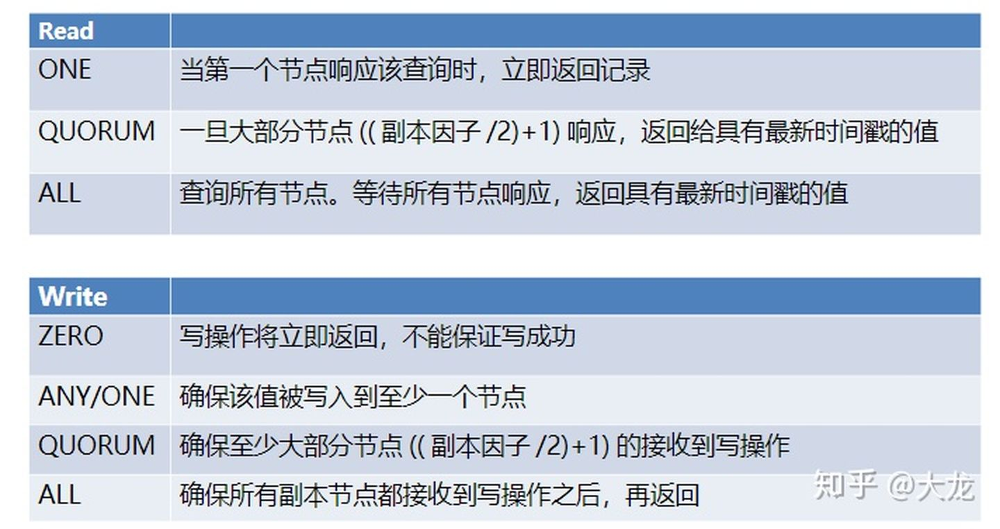

- [Redis](#redis)
  - [Redis为什么这么快？](#redis为什么这么快)
    - [I/O多路复用技术](#io多路复用技术)
      - [IO模式](#io模式)
  - [Redis支持的数据结构](#redis支持的数据结构)
    - [String](#string)
    - [List](#list)
    - [Hash](#hash)
    - [Set](#set)
    - [Sorted Set](#sorted-set)
  - [淘汰策略](#淘汰策略)
    - [**noeviction**](#noeviction)
    - [随机淘汰(所有|过期)](#随机淘汰所有过期)
    - [LRU（所有|过期）](#lru所有过期)
  - [Redis的分布式锁](#redis的分布式锁)
    - [锁的特性](#锁的特性)
    - [单节点锁实现](#单节点锁实现)
      - [SETNX](#setnx)
      - [超时时间设置](#超时时间设置)
    - [释放锁时先检查](#释放锁时先检查)
    - [综上总结](#综上总结)
    - [RedLock](#redlock)
      - [延迟重启](#延迟重启)
        - [如何解决一个Redis节点挂了出现锁被同时两个客户端获得的问题？](#如何解决一个redis节点挂了出现锁被同时两个客户端获得的问题)
        - [如何解决时间不一致导致的超时时间不一致问题？](#如何解决时间不一致导致的超时时间不一致问题)
      - [RedLock的问题](#redlock的问题)
        - [使用所得目的](#使用所得目的)
      - [RedLock的分布式实现](#redlock的分布式实现)
        - [续租满足特性](#续租满足特性)
  - [redis持久化](#redis持久化)
    - [触发时机](#触发时机)
    - [RDB](#rdb)
    - [AOF](#aof)
    - [混合持久化](#混合持久化)
    - [持久化方案的建议](#持久化方案的建议)
  - [集成方案](#集成方案)
    - [主从复制模式](#主从复制模式)
      - [工作机制](#工作机制)
      - [优点](#优点)
      - [缺点](#缺点)
    - [Sentinel（哨兵）模式](#sentinel哨兵模式)
      - [工作机制](#工作机制-1)
      - [优点](#优点-1)
      - [缺点](#缺点-1)
    - [Cluster模式](#cluster模式)
      - [工作机制](#工作机制-2)
      - [优点](#优点-2)
      - [缺点](#缺点-2)
      - [Cluster模式集群节点最小配置6个节点(3主3从，因为需要半数以上)，其中主节点提供读写操作，从节点作为备用节点，不提供请求，只作为故障转移使用。](#cluster模式集群节点最小配置6个节点3主3从因为需要半数以上其中主节点提供读写操作从节点作为备用节点不提供请求只作为故障转移使用)
        - [参考：Redis集群详解（上）](#参考redis集群详解上)
    - [集群伸缩](#集群伸缩)
      - [集群扩容](#集群扩容)
        - [迁移过程中路由问题如何解决？](#迁移过程中路由问题如何解决)
        - [迁移的本质是什么？](#迁移的本质是什么)
      - [集群收缩](#集群收缩)
    - [故障自动检测与自动恢复](#故障自动检测与自动恢复)
      - [故障发现](#故障发现)
      - [广播信息](#广播信息)
      - [故障迁移](#故障迁移)
        - [资格检查](#资格检查)
        - [休眠时间计算](#休眠时间计算)
        - [发起拉票&选举投票](#发起拉票选举投票)
        - [替换节点](#替换节点)
        - [集群配置更新](#集群配置更新)
    - [待定](#待定)

# Redis

> Redis的全称是**RE**mote **DI**ctionary **S**erver，是一个高效的内存键值数据库，常被用来做分布式的高速缓存，相比较我们常规使用的Mysql、MongoDB等数据库，Redis的最大特点在于数据读写全部在内存中进行，进而带来极大的效率优势。相比较其他的内存键值存储系统如Memcached， Redis支持更多的数据结构，极大的提升了使用的易用性。

## Redis为什么这么快？

1. `数据读写在内存中完成；（主要原因）`
2. 单线程请求处理；（多线程并行对数据读取有好处，但是也有数据写入锁的开销和线程上下文切换开销）
3. I/O多路复用技术。又称事件驱动，Redis基于[epoll](https://blog.csdn.net/HDUTigerkin/article/details/7517390)等技术实现了网络部分响应的同步非阻塞I/O模式；

### I/O多路复用技术

参考：[Redis详解（2）——Redis是如何做到单线程服务10000客户端的?](https://zhuanlan.zhihu.com/p/95840826)

​		[I/O多路复用技术（multiplexing）是什么？](https://www.zhihu.com/question/28594409)

#### IO模式

> 类Unix中，万物皆文件；每个文件都有一个唯一的[文件描述符](https://zh.wikipedia.org/wiki/%E6%96%87%E4%BB%B6%E6%8F%8F%E8%BF%B0%E7%AC%A6)fd(File Descriptor)来代表。文件有stdin、stdout、stderr三种标准流；

水房接水，类比read()函数读取文件，拧开有水表示可读，无水表示不可读或异常；

- 阻塞IO模式：一直在水房等待，直到接上水（变为可读）；即是调用read（）读取到内容或出错才返回；
- 非阻塞IO模式：发现没水立马返回，过一会儿再来查看是否有水；即无论文件可不可读，read函数都立马返回，如果可读就返回文件内容，如果不可读，就返回一个不可读标识符。

## Redis支持的数据结构

> 理论上，内存KV数据存储只需要支持字符串就能支持所有的数据类型存储；其他列表、字典，只需要将数据进行序列化就行；缺点就是修改需要每次获得所有数据再传回，I/O增加，使用体验不好；Memcached即是如此。

### String

> 存取序列化后的字符串，支持原生和数字字符串；存取复杂度为O(1);

| 命令 | 含义           |
| ---- | -------------- |
| set  | 设置键值       |
| get  | 获取给定键的值 |
| del  | 删除给定键的值 |

### List

> Redis底层采用*双向链表*实现；端点插入和查询O(1),中间位置获取连续多个值O(n);

| 命令          | 含义                      |
| :------------ | :------------------ |
| lpush/rpush   | 向列表 左端/右端 插入数据 |
| lpop/rpop     | 向列表 左端/右端 删除数据 |
| lrange/range | 去除从 左端/右端 开始计数的位置处于[start,end]之间的所有value |
| lindex/rindex | 删除从 左端/右端 开始计数的第index个值 |

### Hash

> 字典数据结构;采用`散列表`实现；类似于HashMap。

### Set

> 集合，满足集合`确定性、无序性、唯一性` 三个性质；散列表实现；

### Sorted Set

> 有序集合，满足唯一性和有序性；插入会指定一个Score作为排序标准。 Sorted Set的底层实现采用的是**Skip List**， 所以其单个元素的存取效率可以近似认为是O(logn)的。有序集合的操作命令主要如下：

```
ZADD KEY_NAME SCORE1 VALUE1
```

## 淘汰策略

> Redis把所有设置了过期时间的键放到一个单独的链表里面进行维护。内存不足时，会使用六大策略淘汰；

### **noeviction**

> 不淘汰策略；表示Redis不主动清除键。清除动作由用户决定；当内存不够时；拒绝所有写入操作并返回客户端错误信息"(error) OOM command not allowed when used memory"，此时 Redis 只响应读操作。

### 随机淘汰(所有|过期)

> 随机选取一些键进行删除；
- allkeys-random：随机删除所有键，直到腾出足够空间为止；

- volatile-random: 随机删除过期键，直到腾出足够空间为止；

### LRU（所有|过期）

> Least Recently Used最近最少使用原则
- allkeys-lru：根据 LRU 算法删除键，不管数据有没有设置超时属性，直到腾出足够空间为止。
- volatile-lru(默认): 超过最大内存后，在过期键中使用 lru 算法进行 key 的剔除，保证不过期数据不被删除，但是可能会出现 OOM 问题。
- volatile-ttl：设置了ttl（time to live） 属性，优先删除剩余时间短的key。如果没有，回退到 noeviction 策略。

## Redis的分布式锁

参考：[基于Redis的分布式锁详解](https://zhuanlan.zhihu.com/p/100140241)

> 锁的申明和释放一定要基于各个工作流都可见的区域来实现。分布式场景中，需要所有机器可见区域实现锁。同时在不稳定网络、机器不可靠、机器时间不一致等条件下满足锁的连个特性。

### 锁的特性

1. 互斥性：同一时刻，一个锁只能被一个工作流持有；
2. 避免死锁：避免持有锁的工作流因为故障无法释放锁，进而使其他的工作流永远都无法获得锁。

### 单节点锁实现

> 单节点Redis的锁实现主要有三大点： SETNX的使用、超时时间设置以及释放锁前先检查锁。

#### SETNX

```c
def Job():
  identifier = str(uuid.uuid4())
  lock_name = "mylock"
  try:
    #一直循环等待获得锁
    while True:
        #如果获得锁c成功就完成工作并退出循环
        if lock(lock_name):
          do_something()
          break
  finally:
    #释放锁
    unlock(lock_name)
   
def lock(lock_name):
  return redis.setnx(lock_name, identifier)

def unlock(lock_name):
  redis.delete(lock_name)
```

#### 超时时间设置

> 不能完全依赖主动释放，要给锁设置超时时间，超过时间未释放会被Redis强制释放。

```c
def lock(lock_name, lock_timeout):
  if redis.setnx(lock_name, identifier):
    redis.expire(lock_name,lock_timeout)
    return True
  return False 

def unlock(lock_name):
  redis.delete(lock_name)
```

### 释放锁时先检查

> 带有超时特性的锁满足了避免死锁的性质，但是这种auto release的机制的却很有可能破坏锁的互斥性质。通过get得到identifier，判断是否是自己存的identifier释放锁（避免释放其他线程或进程正在使用的锁）；

### 综上总结

1. **使用SETNX实现排他性锁；**
2. **使用超时限制特性来避免死锁；**
3. **释放锁的时候需要进行检查来避免误释放别的进程的锁。**

### RedLock

> **核心思想就在于使用多个Redis冗余实例来避免单Redis实例的不可靠性。**RedLock采用的就是依据法团准则（大于一半）的方案。



#### 延迟重启

##### 如何解决一个Redis节点挂了出现锁被同时两个客户端获得的问题？

- 假设N0挂了，只有挂掉这个时刻N0节点上所有锁受影响。之后创建的新锁或者没存在N0上的锁均不受影响；

- 每个锁都设置了超时时间，设置N0延迟时间为 `MAX TTL`（会统计当前时刻所有节点的max）,这样即可保证当N0重新服务后，其上所有锁均会失效；

##### 如何解决时间不一致导致的超时时间不一致问题？

- 使用理论时间戳（即开始设置时，本地机器的时间戳+TTL）是最保险的方案，因为它肯定是最小的。
- 为了避免在获取锁的过程中因为网络的问题占用了过多的锁可使用时间，每次从一个机器获取锁的时候都在网络上只等一个非常小的时间，超时还未获得锁就立马尝试下一个节点。

#### RedLock的问题

1. RedLock**可能的最大问题**在于对各个机器时间流速的一致性假设。
2. 问题出现在**auto release的机制上**。自动超时释放但该线程还在运行，但可被其他线程或进程拿到；

##### 使用所得目的

1. 为了效率着想，比如我们不想让一个耗时的任务被重复的执行;
2. 为了程序的正确性考虑。

**总结：**可承受不正确性可使用。

#### RedLock的分布式实现

##### 续租满足特性

1. 如果程序正常运行，但是锁的到期时间快到了，那么就应该续租；
2. 如果程序终止，则停止续租；
3. 如果程序使用锁期间，陷入死循环，则停止续租。

## [redis持久化](https://www.cnblogs.com/richiewlq/p/12191261.html)

> 存储可cache-only|persistence。

### 触发时机

- 手动触发

- 自动触发

### RDB

> 全称redis database；在指定的时间间隔内将内存中的数据集快照写入磁盘，也就是行话讲的Snapshot快照，它恢复时直接将快照文件直接读到内存里。

- 主要配置

  - save 900 1 # 在900s内存在至少一次写操作

  - save "" # 禁用RBD持久化

  - stop-writes-on-bgsave-error yes # 当备份进程出错时主进程是否停止写入操作

  - rdbcompression no  # 是否压缩rdb文件 推荐no 相对于硬盘成本cpu资源更贵

- 与AOF相比，RDB文件相对较小，恢复数据比较快

- 服务器宕机，RBD方式会丢失掉上一次RDB持久化后的数据

- 使用bgsave `fork子进程`(会拷贝所有父进程数据)时会耗费内存;Unix类操作系统上面，做了如下的优化：在刚开始的时候父子进程共享相同的内存，直到父进程或者子进程进行内存的写入后，对被写入的内存共享才结束。这样就会减少Redis持久化时对内存的消耗。

### AOF

> AOF全称Append Only File，以redis执行过的所有写指令记录下来（读操作不记录），只许追加文件但不可以改写文件，redis启动之初会读取该文件重新构造数据，换言之，redis重启的话就根据日志文件的内容将写指令从前到后执行一次以完成数据的恢复工作。**AOF重写**用于删除掉冗余的命令。


- 主要配置

  - appendonly no # 默认关闭AOF，若要开启将no改为yes；

  - appendfilename "appendonly.aof" # append文件的名字；

  - appendfsync everysec # 每隔一秒将缓存区内容写入文件 默认开启的写入方式；

  - auto-aof-rewrite-percentage 100 # 当AOF文件大小的增长率大于该配置项时自动开启重写（这里指超过原大小的100%）。

  - auto-aof-rewrite-min-size 64mb # 当AOF文件大小大于该配置项时自动开启重写。

- AOF只是追加文件，对服务器性能影响较小，速度比RDB快，消耗内存也少，同时可读性高。

- 生成的文件相对较大，即使通过AOF重写，仍然会比较大；

- 恢复数据的速度比RDB慢；

### 混合持久化

- 4.0版开始支持

- 兼容性差，一旦开启了混合持久化，在4.0之前的版本都不识别该持久化文件

- aof-use-rdb-preamble yes # 开启混合持久化

### 持久化方案的建议

- 如果Redis只是用来做缓存服务器，比如数据库查询数据后缓存，那可以不用考虑持久化，因为缓存服务失效还能再从数据库获取恢复

- 如果你要想提供很高的数据保障性，那么建议你同时使用两种持久化方式。如果你可以接受灾难带来的几分钟的数据丢失，那么可以仅使用RDB

- 通常的设计思路是利用主从复制机制来弥补持久化时性能上的影响。即Master上RDB、AOF都不做，保证Master的读写性能，而Slave上则同时开启RDB和AOF（或4.0以上版本的混合持久化方式）来进行持久化，保证数据的安全性

## 集成方案

### 主从复制模式

#### 工作机制

- slave启动后，向master发送SYNC命令，master接收到SYNC命令后通过bgsave保存快照（即上文所介绍的RDB持久化），并使用缓冲区记录保存快照这段时间内执行的写命令

- master将保存的快照文件发送给slave，并继续记录执行的写命令

- slave接收到快照文件后，加载快照文件，载入数据

- master快照发送完后开始向slave发送缓冲区的写命令，slave接收命令并执行，完成复制初始化

- 此后master每次执行一个写命令都会同步发送给slave，保持master与slave之间数据的一致性

#### 优点

- master能自动将数据同步到slave，可以进行读写分离，分担master的读压力

- master、slave之间的同步是以非阻塞的方式进行的，同步期间，客户端仍然可以提交查询或更新请求

#### 缺点

- 不具备自动容错与恢复功能，master或slave的宕机都可能导致客户端请求失败，需要等待机器重启或手动切换客户端IP才能恢复

- master宕机，如果宕机前数据没有同步完，则切换IP后会存在数据不一致的问题

- 难以支持在线扩容，Redis的容量受限于单机配置

### Sentinel（哨兵）模式

#### 工作机制

在配置文件中通过sentinel monitor <master-name> <ip> <redis-port> <quorum>来定位master的IP、端口，一个哨兵可以监控多个master数据库，只需要提供多个该配置项即可。哨兵启动后，会与要监控的master建立两条连接：

- 一条连接用来订阅master的sentinel:hello频道与获取其他监控该master的哨兵节点信息

- 另一条连接定期向master发送INFO等命令获取master本身的信息

- 与master建立连接后，哨兵会执行三个操作：

- 定期（一般10s一次，当master被标记为主观下线时，改为1s一次）向master和slave发送INFO命令

- 定期向master和slave的sentinel:hello频道发送自己的信息

- 定期（1s一次）向master、slave和其他哨兵发送PING命令

- 发送INFO命令可以获取当前数据库的相关信息从而实现新节点的自动发现。所以说哨兵只需要配置master数据库信息就可以自动发现其slave信息。获取到slave信息后，哨兵也会与slave建立两条连接执行监控。通过INFO命令，哨兵可以获取主从数据库的最新信息，并进行相应的操作，比如角色变更等。

- 接下来哨兵向主从数据库的sentinel:hello频道发送信息与同样监控这些数据库的哨兵共享自己的信息，发送内容为哨兵的ip端口、运行id、配置版本、master名字、master的ip端口还有master的配置版本。这些信息有以下用处：

- 其他哨兵可以通过该信息判断发送者是否是新发现的哨兵，如果是的话会创建一个到该哨兵的连接用于发送PING命令。

- 其他哨兵通过该信息可以判断master的版本，如果该版本高于直接记录的版本，将会更新

- 当实现了自动发现slave和其他哨兵节点后，哨兵就可以通过定期发送PING命令定时监控这些数据库和节点有没有停止服务。

- 如果被PING的数据库或者节点超时（通过 sentinel down-after-milliseconds master-name milliseconds 配置）未回复，哨兵认为其主观下线（sdown，s就是Subjectively —— 主观地）。

- 如果下线的是master，哨兵会向其它哨兵发送命令询问它们是否也认为该master主观下线，如果达到一定数目（即配置文件中的quorum）投票，哨兵会认为该master已经客观下线（odown，o就是Objectively —— 客观地），并选举领头的哨兵节点对主从系统发起故障恢复。

- 若没有足够的sentinel进程同意master下线，master的客观下线状态会被移除，若master重新向sentinel进程发送的PING命令返回有效回复，master的主观下线状态就会被移除。

- 哨兵认为master客观下线后，故障恢复的操作需要由选举的领头哨兵来执行，选举采用Raft算法：

  - 发现master下线的哨兵节点（我们称他为A）向每个哨兵发送命令，要求对方选自己为领头哨兵
  - 如果目标哨兵节点没有选过其他人，则会同意选举A为领头哨兵
  - 如果有超过一半的哨兵同意选举A为领头，则A当选
  - 如果有多个哨兵节点同时参选领头，此时有可能存在一轮投票无竞选者胜出，此时每个参选的节点等待一个随机时间后再次发起参选请求，进行下一轮投票竞选，直至选举出领头哨兵
- 选出领头哨兵后，领头者开始对系统进行故障恢复，从出现故障的master的从数据库中挑选一个来当选新的master,选择规则如下：
  - 所有在线的slave中选择优先级最高的，优先级可以通过slave-priority配置
  - 如果有多个最高优先级的slave，则选取复制偏移量最大（即复制越完整）的当选
  - 如果以上条件都一样，选取id最小的slave

挑选出需要继任的slave后，领头哨兵向该数据库发送命令使其升格为master，然后再向其他slave发送命令接受新的master，最后更新数据。将已经停止的旧的master更新为新的master的从数据库，使其恢复服务后以slave的身份继续运行。

#### 优点

- 哨兵模式基于主从复制模式，所以主从复制模式有的优点，哨兵模式也有

- 哨兵模式下，master挂掉可以自动进行切换，系统可用性更高

#### 缺点

- 同样也继承了主从模式难以在线扩容的缺点，Redis的容量受限于单机配置

- 需要额外的资源来启动sentinel进程，实现相对复杂一点，同时slave节点作为备份节点不提供服务

### Cluster模式

```
HASH_SLOT = CRC16(key) mod 16384
```

#### 工作机制

- 在Redis的每个节点上，都有一个插槽（slot），取值范围为0-16383。

- 当我们存取key的时候，Redis会根据CRC16的算法得出一个结果，然后把结果对16384求余数，这样每个key都会对应一个编号在0-16383之间的哈希槽，通过这个值，去找到对应的插槽所对应的节点，然后直接自动跳转到这个对应的节点上进行存取操作。

- 为了保证高可用，Cluster模式也引入主从复制模式，一个主节点对应一个或者多个从节点，当主节点宕机的时候，就会启用从节点。

- 当其它主节点ping一个主节点A时，如果半数以上的主节点与A通信超时，那么认为主节点A宕机了。如果主节点A和它的从节点都宕机了，那么该集群就无法再提供服务了。

#### 优点

- 无中心架构，数据按照slot分布在多个节点。

- 集群中的每个节点都是平等的关系，每个节点都保存各自的数据和整个集群的状态。每个节点都和其他所有节点连接，而且这些连接保持活跃，这样就保证了我们只需要连接集群中的任意一个节点，就可以获取到其他节点的数据。

- 可线性扩展到1000多个节点，节点可动态添加或删除。

- 能够实现自动故障转移，节点之间通过gossip协议交换状态信息，用投票机制完成slave到master的角色转换。

#### 缺点

- 客户端实现复杂，驱动要求实现Smart Client，缓存slots mapping信息并及时更新，提高了开发难度。目前仅JedisCluster相对成熟，异常处理还不完善，比如常见的“max redirect exception”。

- 节点会因为某些原因发生阻塞（阻塞时间大于 cluster-node-timeout）被判断下线，这种failover是没有必要的。

- 数据通过异步复制，不保证数据的强一致性。

- slave充当“冷备”，不能缓解读压力。

- 批量操作限制，目前只支持具有相同slot值的key执行批量操作，对mset、mget、sunion等操作支持不友好。

- key事务操作支持有线，只支持多key在同一节点的事务操作，多key分布不同节点时无法使用事务功能。

- 不支持多数据库空间，单机redis可以支持16个db，集群模式下只能使用一个，即db 0 Redis。

- Cluster模式不建议使用pipeline和multi-keys操作，减少max redirect产生的场景。

#### Cluster模式集群节点最小配置6个节点(3主3从，因为需要半数以上)，其中主节点提供读写操作，从节点作为备用节点，不提供请求，只作为故障转移使用。

##### 参考：[Redis集群详解（上）](https://zhuanlan.zhihu.com/p/104641341)

> 对于分布式存储，数据分区规则是核心问题之一，Redis集群中使用的是虚拟槽/虚拟桶分区，使用CRC16函数计算每个键的哈希值，并把所有的键划分到16384个桶中。数据存储在各个结点之后，当客户端访问键时，需要能够知道键所在的节点地址，Redis集群没有采用代理的方案，而是每个节点都保存集群中槽的负责节点信息，客户端可连接任意一个节点，当该节点发现客户端请求的键并不由自己负责时，会向客户端返回重定向，重定向中包含着负责该键的节点地址信息。同路由信息一样，Redis的集群元数据信息也是存储在各个节点上，并使用Gossip协议来完成集群的元数据同步。每个集群节点会每100ms向部分节点随机传输自己视角下的N/10个节点的信息，同时Redis集群节点会努力保证自己与其他的所有节点每node_timeout/2时间内至少通信一次。

### 集群伸缩

参考：[Redis集群(中) —— 集群伸缩](https://zhuanlan.zhihu.com/p/105569485)

> 伸缩本质是slot在不同节点之间的迁移；解决数据路由问题。
>
> 扩缩容最核心的地方还是数据的迁移，扩容和缩容的最大区别除了数据迁移的方向之外，就是扩容添加新节点后，需要向整个集群广播slot被新的节点负责的信息，而集群收缩下线节点时，需要向集群广播让所有节点forget掉下线节点。同时在数据迁移过程中，我们需要解决的很重要的问题就是数据路由问题，Redis通过ASK重定向和MOVED重定向解决了该问题。

#### 集群扩容

> Redis集群没有实现负载均衡，slots迁移由用户指定。

1. 准备新节点；
2. 加入集群；
3. 迁移slot到新节点。

##### 迁移过程中路由问题如何解决？

> 设置节点slot的迁入迁出状态。
>

##### 迁移的本质是什么？

> 将slot中的键值搬迁；两个非集群模式也可使用**migrate**进行迁移。
>
> 键值迁移结束后，会向集群每个节点广播该slot所处节点的消息。

#### 集群收缩

> 即让其中一些节点安全下线。所谓的安全下线指的是让一个节点下线之前我们需要把其负责的所有slots迁移到别的节点。

### 故障自动检测与自动恢复

参考：[Redis集群（终篇）——故障自动检测与自动恢复（附优质Redis资源汇总）](https://zhuanlan.zhihu.com/p/106110578)

> 让下线Master节点的Slave节点来成为新的Master节点，接管旧Master负责的所有slots向外提供服务。

- 当集群中一个Master故障后，让其子节点代替继续向外提供服务。称为**slave promotion**。
- 当集群一个Master节点为**Orphaned Master**节点时，会从其他有富余子节点的地方迁移过来一个子节点给这个孤立节点。

#### 故障发现

> 采用多数投票的方案。

- redis每个节点会向其它节点发送PING消息来同步信息同时检测其它节点是否可达；当节点发现有其它节点断连时间超过node_timeout时，会标记该节点为`PFAIL`，即`Possible failure`，可以中文意为主观下线。
- 发现PFAIL后，该节点会通过Gossip消息发送给其他节点，其他节点（认为所报告的节点为PFAIL）会进行客观下线状态判断。
- 超过1/2数目节点数同样认为该节点为PFAIL，即可判定为FAIL。并会立刻广播这个信息。

#### 广播信息

> 向全集群广播标记为FAIL的信息CLUSTERMSG_TYPE_FAIL。接收到的节点均会更新自己维护的节点状态信息。

#### 故障迁移

> 当FAIL状态节点的子节点接收到信息后，就会开始发起故障迁移，竞选成为新的Master；当多个子节点时，参与竞选都会首先检查自身是否有资格竞选。

##### 资格检查

> Redis认为，当一个Slave节点过长时间不与Master节点通信，即为不具备参选资格；

##### 休眠时间计算

> 采用Raft协议选举。首先参与选举的节点随机休眠一段时间，一旦唤醒立刻向所有的投票节点发起拉票请求。对于投票节点，每轮选举只能投一票；投票规则就是先到先得；一般休眠最短的节点容易获得大部分投票。

休眠时间由两部分组成：

1. 固定的500ms。这500ms主要为了等待集群状态同步（确保集群的所有阶段都收到了消息并更新了状态）。
2. 随机加上该Slave节点的排名决定的附加时间。（偏移量越大，排名越高）


```
DELAY = 500 milliseconds + random delay between 0 and 500 milliseconds + SLAVE_RANK * 1000 milliseconds.
```

##### 发起拉票&选举投票

- 所有的节点（主+从）均会收到拉票请求，但只有主节点才具备投票资格。
- 主节点收到拉票请求，如果本轮该主节点没有投出票，即会投给发送方，回复*FAILOVER_AUTH_ACK*消息；当有节点获得ACK消息一半以上就会开始执行failover，即替换自己的主节点过程。

##### 替换节点

1. 首先标记自己为主节点；
2. 将原master节点负责的slot标记为自己负责；
3. 向整个集群广播自己是Master的信息；其它节点接收到消息后会更新自己维护的状态信息。

##### 集群配置更新

> 新的节点成为Master后，当前故障Master重新上线后，会自动成为其子节点；之前的Slave亦是。

*综上故障迁移步骤：*

1. 子节点竞选资格检查；
2. 子节点休眠时间计算；
3. 子节点发起拉票，其他主节点投票；
4. 获得多数票的子节点替换其主节点并向集群所有节点广播该信息；
5. 其他节点接收信息后更新配置；
6. 原先主节点以及其Slave自动成为新的主节点的Slave。


### 待定

- 监控分析

- Redis为什么快

- 应用使用redis注意

- 参数解读

- 运维经验

  - [优酷蓝鲸近千节点的 Redis 集群运维经验总结](https://www.infoq.cn/article/2016/08/youku-Redis-nosql?utm_source=related_read&utm_medium=article)

  - [Redis 内存使用优化与存储](https://www.infoq.cn/article/tq-redis-memory-usage-optimization-storage?utm_source=related_read&utm_medium=article)

  - [阿里云 Redis 开发规范](https://www.infoq.cn/article/K7dB5AFKI9mr5Ugbs_px?utm_source=related_read&utm_medium=article)

